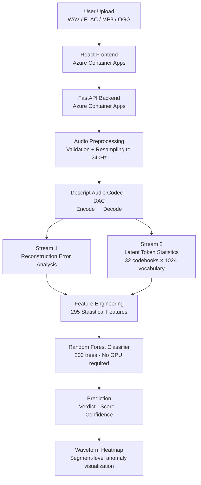
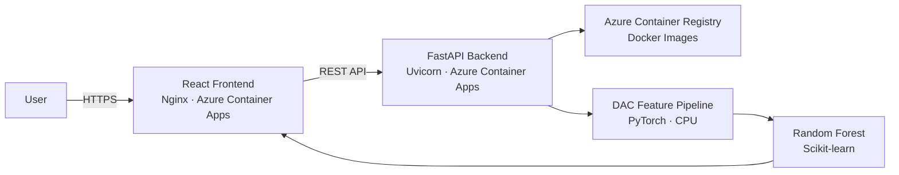

# Neural Codec Audio Deepfake Detector

<p align="center">


</p>

> A lightweight audio deepfake detector using Neural Audio Codec representations instead of large pretrained speech models. Achieves **0.862 AUC** on ASVspoof 2019 LA under speaker-disjoint evaluation using only **2,000 labeled clips** and **no GPU at inference time**.

---

## Live Demo

| Service | URL |
|---------|-----|
| Frontend | https://deepfake-frontend.kindbay-309802f0.southeastasia.azurecontainerapps.io |
| Backend API | https://deepfake-api.kindbay-309802f0.southeastasia.azurecontainerapps.io |
| API Docs | https://deepfake-api.kindbay-309802f0.southeastasia.azurecontainerapps.io/docs |

Upload a WAV, FLAC, MP3, or OGG (WhatsApp voice note) file to receive a verdict, authenticity score, and a waveform heatmap highlighting suspicious segments.

---

## Overview

The rapid improvement of neural speech synthesis has made synthetic voice increasingly indistinguishable from genuine human recordings. Most state-of-the-art detectors depend on large self-supervised speech models like Wav2Vec2 XLS-R (~1.2GB, GPU required), which are expensive to run and difficult to deploy at scale.

This project investigates a different approach: instead of learning from raw waveforms or large pretrained encoders, it analyzes compressed neural representations from the **Descript Audio Codec (DAC)**. When real and synthetic speech pass through DAC, they produce measurably different reconstruction error patterns and latent token distributions — and these differences are sufficient for detection using a lightweight Random Forest classifier.

The system requires **no GPU at inference time**, trains on **2,000 labeled clips** (versus the tens of thousands typically needed), and provides **segment-level explainability** showing exactly where in a recording the suspicious artifacts occur.

---

## Motivation

This project was motivated by [CodecFake (Wu et al., Interspeech 2024)](https://arxiv.org/abs/2406.07237), which demonstrated that conventional anti-spoofing models trained on older datasets fail on codec-generated synthetic speech. Rather than replicating their Wav2Vec2+AASIST pipeline, this work investigates a different question:

> Can the neural codec's own representations — reconstruction error and latent token statistics — provide sufficient discriminative signal without any large pretrained model?

The answer, validated across ablation studies and a speaker-disjoint leakage audit on ASVspoof 2019 LA, is yes.

**The practical case:** Voice cloning fraud is rising rapidly. Fraudsters clone a relative's or bank official's voice from seconds of audio and use it to request urgent money transfers — primarily over WhatsApp and phone calls. Most deepfake detectors require large cloud-based models. This system is lightweight enough to run as a fast first-pass filter on any device, flagging suspicious clips before escalating ambiguous cases to heavier systems.

---

## Key Results

| Evaluation Protocol | ROC-AUC | EER |
|---------------------|:-------:|:---:|
| Speaker-disjoint GroupKFold *(primary)* | **0.862** | **22.8%** |
| Held-out validation set | 0.901 | 17.0% |
| Standard 5-fold CV | 0.897 | 19.1% |
| Random chance baseline | 0.500 | 50.0% |

The **speaker-disjoint** result is reported as primary because it prevents speaker overlap between train and test folds, providing the most realistic estimate of generalization. Standard CV inflates scores when the same speaker appears in both splits — a common issue in audio benchmark datasets that this project explicitly audits and corrects for.

---

## System Architecture



---

## Detection Pipeline

### 1. Neural Codec Encoding

Uploaded audio is processed through the **Descript Audio Codec (DAC)**, a neural compression model that encodes speech into 32 discrete codebooks, each with a vocabulary of 1,024 tokens. This compressed representation is then decoded back to audio.

The key insight: real and synthetic speech produce **different reconstruction error patterns** and **different codebook usage statistics** when passed through DAC — because synthetic audio generated by TTS models carries its own artifacts that interact with the codec differently.

### 2. Dual-Stream Feature Extraction

**Stream 1 — Reconstruction Error**

Frame-level difference between original and DAC-reconstructed audio:
- Mean, standard deviation, percentiles of reconstruction error
- High-error ratio per frame
- All computed globally and in 500ms sliding windows

**Stream 2 — Latent Token Statistics**

Analysis of the (32, T) discrete token tensor:
- Per-codebook entropy — diversity of token usage
- Per-codebook repeat rate — consecutive identical tokens
- Token histograms per codebook
- Token transition statistics
- All computed in 500ms sliding windows

**Combined:** 295 engineered statistical features per clip.

### 3. Classification

A Random Forest (200 trees) trained on 2,000 ASVspoof 2019 LA clips classifies the feature vector. Outputs include spoof probability, authenticity score, confidence, and per-window anomaly scores used for the heatmap.

---

## Ablation Study

Each feature family was evaluated independently before combining:

| Configuration | ROC-AUC | What This Proves |
|---------------|:-------:|-----------------|
| Global token statistics only | 0.71 | Codec token space contains a real spoofing signal |
| Per-codebook token features | 0.75 | Codebook-level granularity helps |
| Reconstruction error only | 0.77 | Reconstruction artifacts are stronger than tokens alone |
| Dual stream (recon + tokens) | 0.83 | Combining streams is synergistic |
| Full pipeline (+ histograms + windows) | **0.85** | Temporal windowing adds meaningful signal |

The progression from 0.71 to 0.85 through systematic feature enrichment validates each design decision individually — this is not a single model trained and evaluated once.

---

## Data Leakage Audit

Audio deepfake datasets frequently contain speaker overlap between training and evaluation splits, which can artificially inflate accuracy by allowing models to memorize speaker identity rather than spoof-specific artifacts.

This project includes a dedicated leakage audit:

- **Standard CV:** Same speakers appear in train and test → 0.897 AUC (optimistic)
- **Speaker-disjoint GroupKFold:** No speaker overlap → 0.862 AUC (honest)

The 3.5-point AUC drop confirms speaker leakage existed and was measurable. The speaker-disjoint result is reported throughout as the primary metric.

---

## Explainability

Unlike detectors that output only a binary prediction, this system visualizes **where** in a recording suspicious artifacts occur.

For every uploaded clip the application returns:
- Authenticity score and spoof probability
- Prediction confidence
- Per-window reconstruction error scores (500ms resolution)
- Waveform heatmap — green for clean segments, red for anomalous segments
- Hover tooltips showing exact start/end timestamps and scores per window

---

## Design Philosophy: Lightweight First Pass

This system is intentionally designed as a **fast, low-cost first-line filter** rather than a replacement for heavyweight research systems.

| Property | This System | W2V2+AASIST |
|----------|:-----------:|:-----------:|
| Model size | ~50MB | ~1.2GB |
| GPU required | No | Yes |
| Training data | 2,000 clips | 25,000+ clips |
| EER (honest eval) | 22.8% | ~2-5% |
| Inference speed | Fast (CPU) | Slower (GPU) |

**Suggested production architecture:** This system runs first on every clip. Only cases with spoof probability between 0.3–0.7 (ambiguous) escalate to a heavier cloud-based model for final confirmation. This reduces compute cost by an order of magnitude for clear-cut cases.

---

## Deployment Architecture



Both services are independently containerized and deployed on **Azure Container Apps** with HTTPS endpoints. Container images are stored in **Azure Container Registry**.

---

## Repository Structure

audio-deepfake-detector/

│
├── backend/
│   ├── app/
│   │   └── main.py                  # FastAPI inference service
│   └── Dockerfile
│
├── frontend/
│   ├── src/
│   │   ├── components/
│   │   │   ├── WaveformHeatmap.tsx  # Canvas waveform + heatmap overlay
│   │   │   └── ResultsPanel.tsx     # Verdict + scores display
│   │   ├── api.ts                   # Backend API client
│   │   └── types.ts                 # Shared TypeScript types
│   └── Dockerfile
│
├── src/
│   ├── features/
│   │   ├── dac_pipeline.py          # DAC encode/decode interface
│   │   ├── dac_recon_features.py    # Stream 1: reconstruction error
│   │   ├── dac_token_features.py    # Stream 2: codebook statistics
│   │   ├── dac_window_features.py   # 500ms windowed aggregation
│   │   └── extract_hypothesis_features.py  # Feature orchestrator
│   ├── models/
│   │   └── train_final_models.py    # RF + MLP training pipeline
│   └── validation/
│       ├── hypothesis_validation.py # Ablation study
│       ├── leakage_audit.py         # Speaker-disjoint evaluation
│       └── evaluate_winning_pipeline.py
│
├── models/
│   ├── deepfake_detector_rf.pkl     # Trained Random Forest
│   └── feature_cols.pkl             # Feature column order
│
├── reports/
│   └── evaluation/                  # ROC curves, confusion matrices
│
├── HYPOTHESIS_VALIDATION.md
├── LEAKAGE_AUDIT.md
└── README.md

---

## Local Setup

### Backend

```bash
git clone https://github.com/anugrahanirmalnair/audio-deepfake-detector.git
cd audio-deepfake-detector

python -m venv venv
source venv/bin/activate        # Windows: venv\Scripts\activate

pip install -r requirements.txt

uvicorn backend.app.main:app --reload
```

API available at `http://127.0.0.1:8000`
Swagger docs at `http://127.0.0.1:8000/docs`

### Frontend

```bash
cd frontend
npm install
npm run dev
```

Frontend at `http://localhost:3000`

---

## Docker Deployment

```bash
# Backend
docker build --platform linux/amd64 -t deepfake-backend -f backend/Dockerfile .

# Frontend
cd frontend
docker build --platform linux/amd64 -t deepfake-frontend .
```

---

## API Reference

### Health Check

```http
GET /health
```

```json
{ "status": "ok" }
```

### Analyze Audio

```http
POST /analyze
Content-Type: multipart/form-data

audio: <file>
```

```json
{
    "verdict": "FAKE",
    "authenticity_score": 0.15,
    "spoof_probability": 0.85,
    "confidence": 0.85,
    "windows": [
        {
            "start_ms": 493.33,
            "end_ms": 986.67,
            "recon_score": 0.132171,
            "token_score": 0.265904
        }
    ]
}
```

Supported formats: WAV, FLAC, MP3, M4A, OGG, WebM

---

## Tech Stack

| Category | Technologies |
|----------|-------------|
| Language | Python 3.11, TypeScript |
| ML Framework | PyTorch, Scikit-learn |
| Audio | Descript Audio Codec (DAC), torchaudio, librosa |
| Backend | FastAPI, Uvicorn |
| Frontend | React, Vite, TypeScript |
| Visualization | HTML5 Canvas, wavesurfer.js |
| Containerization | Docker |
| Cloud | Azure Container Apps, Azure Container Registry |
| Version Control | Git, GitHub |

---

## Future Work

- Evaluate on the full ASVspoof 2019 LA benchmark (~25k clips)
- Compare codec representations across EnCodec and DAC
- Replace Random Forest with a lightweight 1D CNN operating directly on raw token sequences
- Add confidence calibration layer
- Support real-time streaming inference
- Benchmark against W2V2+AASIST on identical splits for direct comparison
- GPU-enabled inference endpoint for production throughput

---

## References

- Wu et al. (2024). *CodecFake: Enhancing Anti-Spoofing Models Against Deepfake Audios from Codec-Based Speech Synthesis Systems.* Interspeech 2024. [arXiv:2406.07237](https://arxiv.org/abs/2406.07237)
- Lu et al. (2024). *CodecFake: An Initial Dataset for Detecting LLM-based Deepfake Audio.* Interspeech 2024. [arXiv:2406.08112](https://arxiv.org/abs/2406.08112)
- Chen et al. (2025). *CodecFake+: A Large-Scale Neural Audio Codec-Based Deepfake Speech Dataset.* [arXiv:2501.08238](https://arxiv.org/abs/2501.08238)
- Kumar et al. (2023). *High-Fidelity Audio Compression with Improved RVQGAN (DAC).* [arXiv:2306.06546](https://arxiv.org/abs/2306.06546)
- Défossez et al. (2022). *High Fidelity Neural Audio Compression (EnCodec).* [arXiv:2210.13438](https://arxiv.org/abs/2210.13438)
- Wang et al. (2020). *ASVspoof 2019: A Large-Scale Public Database of Synthesized, Converted and Replayed Speech.* Computer Speech & Language.

---

## License

MIT License

---

## Author

**Anugraha Nirmal Nair**
Electronics and Communication Engineering, NIT Calicut
[github.com/anugrahanirmalnair](https://github.com/anugrahanirmalnair) · [linkedin.com/in/anugrahanirmalnair](https://linkedin.com/in/anugrahanirmalnair)